## CCNA Notes- Jeremy IT Lab
#### IPv4 Addressing
* IPv4 address classes 
* finding the 
            - Max number of hosts
            - network address
            - broadcast address
            - first usable address
            - last usable address of a particular network
* configuring IP addresses on Cisco devices 
* Class -A Oxxxxxxx ---> (0-127) => 1-126   ---> Size of network no. bit field ==> 8  rest ==> 24 (host portion)
* Class -B 10xxxxxx --->128 - 191   ---> Size of network no. bit field => 16  rest==> 16 (host portion)
* Class -C 110xxxxx ---> 192 - 223  ---> Size of network no. bit field ==> 24  == 8 (host portion)
* class -D 1100xxxx ---> 224 - 239  
* class -E 1111xxxx ---> 240 - 255

##### Maximum Hosts per Network 
192.168.1.0/24 -----> 192.168.1.255/24

host portion = 8 bits = 2^8 = 256

host portion of all 0's = network address (ID)
host portion of all 1's = broadcast address

Max hosts per network = 2^8 -2 = 254

Layer 1 Status => status 
Layer 2 Status => protocol column 

```
R1(config)#do sh ip int br 
R1# sh interfaces description
R1# int g0/0
R1#(config-if)# description (our note) to SW!
```
#### Switch Interfaces 
* interfaces speed & duplx
* speed and duplex autonegotiation
* interface status 
* interface counters & errors 

*ASR 10000-X Router*
*Catalyst 9200 switch*
<span style="color:red"> *router interfaces are in administratively disable by default--> shutdown command enables whereas in switch interfaces they don't have shutdown command applied Status->up* </span> 

```
SW1(config)#do sh interfaces status
Port Name  Status vlan Duplex Speed Type(SFP or RJ45)`
SW1(config)# int f0/1
SW1(config-if)#speed ?
SW1(config-if)#speed 100
SW1(config-if)#duplex full
*multiple interfaces at same time*
SW1(config)#int range f0/5 - 6, f0/9 - 12
```

#### IPv4 Headers 
**Version => length 4 bits**
* IPv4 ->4 -> 0100
* IPv6 = 6  (0110)

**Internet Header Length (IHL) => 4 bits in length**
* Min value is 5 (20 bytes)
* Maximum value is 15 (15 * 4 bytes = 60 bytes)
* Min IPv4 Header length = 20 bytes 
* Max IPv4 Header length = 60 bytes 

**DSCP Differentiated Services Code Point => 6 bits in Length**
* Used for QoS(Quality of Service)
* Used to prioritize delay-sensitive data(streaming voice, video etc)

**ECN => 2bits in length**
* Explicit Congestion Notification
* Provides end-to-end(betwn two endpoints) notification of network congestion without dropping packets 
* Optional feature that requires both endpoints, as well as the underlying network infrastructure, to support it
    
**Total length=> 16bits**
* Indicates the total length of the packet(L3 header + L4 segment)
* Measured in bytes (not 4 byte increments like IHL)
* Minimum value of 20 (=IPv4 header with no encapsulated data)
* Maximum value of 65,535 (maximum 16-bit value)
    <span style="color:red"> Maximum value of IPv4 packet 65,535</span> 

**Identification 16 bits in length**
* If a packet is fragmented due to being too large, this field is used to identify which packet the fragment belongs to.
* All fragments of the same packet will have their own IPv4 header with the same value in this field 
* Packets are fragmented if larger than the MTU (Maximum Transmission Unit)
* **MTU is 1500 bytes**
* Fragments are reassembled by the receiving host 

**Flags 3 bits**
* Used to control/identify fragments
* Bit 0: Reserved, always set to 0
* Bit 1: Don't Fragment(DF bit), used to indicate a packet that should not be fragmented 
* Bit 2: More Fragments(MF bit), set to 1 if there are more fragments in the packet, set to 0 for the last fragment 
* <span style="color:red"> Unfragmented packets will always have their MF bit set to 0 </span> 

**Fragment Offset 13 bits in length**
 * Used to indicate the position of the fragment within the original, unfragmented IP packet 
* Allows fragmented packets to be reassembled even if the fragments arrive out of order
    
**Time to Live = 8 bits**
* A router will drop a packet with a TTL of 0
* Used to prevent infinite loops 
* Originally designed to indicate the packet's maximum lifetime in seconds 
* In practice, indicates a "hop count" : each time the packet arrives at a router, the router decreases the TTL by 1
* <span style="color:red"> The current recommended default TTL is 64 </span> 

**Protocol 8 bits in length**
* indicated the protocol of the encapsulated L4PDU
* value of 6 :TCP
* value of 17: UDP
* value of 1: ICMP
* value of 89: OSPF (dynamic routing Protocol)
   
**Header checksum => 16 bits**
* A calculated checksum used to check for errors in the IPv4 header 
* When a router receives a packet, it calculates the checksum of the header and compares it to the one in this field of the header 
* if they don't match the router drops the packet 
* Used to check for errors only in the IPv4 Header 
* IP relies on the encapsulated protocol to detect errors in the encapsulated data
* Both TCP and UDP have their own checksum fields to detect errors in the encapsulated data 

**Source IP address**
**Destination IP address**
* 32 bits each
* IPv4 of the sender and receiver 

**Options(if IHL > 5)**
* length 0 - 320 bits 
* rarely used 
* if the IHL field is greater than 5, it means that options are present

`R1# ping 192.168.1.2 size 10000`

`R1# ping 192.168.1.2 df-bit`
**df - don't fragment bit**

#### Static Routing 
**Things covered**
* IP routing process
* The routing table on  a Cisco router 
* Configuring Static routes 

`R1# show ip route `
* connected route = the network the interface is connected to
* Local route = the actual IP address on the interface (with a /32 mask)

**Configuring a Default Route**
* To configure the gateway of the last resort on a Cisco router, you must configure a default route
* A default route is a route that matches all possible destinations 
* It is used only if a more specific route match isn't found in the routing table
* The default route is the least specific route possible:
    *  IP address: 0.0.0.0
    *  Mask : 0.0.0.0
        * <span style="color:red"> To set the default route/gateway of last resort, configure a route to 0.0.0.0/0</span> 
        * 0.0.0.0/0 range includes 0.0.0.0 ~ 255.255.255.255 ( all possible addresses)
        
` ip route destination-address mask next-hop`

**Switches flood frames with unknown destinations(destinations not in the MAC table)**
**Routers drop packets with unknown destinations IP address**

`ip route destination-address mask exit-interface`

`R1(config)# ip route 192.168.4.0 255.255.255.0 g0/0`

* **one way reachability**
* When a router looks up a destination address in it's routing table it looks for the most specific matching route 
* Most specific = longest prefix length (/32 > /24 > /16 > /8 > /0)


#### Life of a Packet 
* Entire process of sending a packet to a remote destination
* Including ARP, encapsulation, de-encapulation etc.

#### Subnetting 
* CIDR (Classless Inter-Domain Routing)
* The process of Subnetting 
* Class A - /8
* Class B - /16
* Class C - /24
* IANA - Internet Assigned Number Authority 
* 203.0.113.0 /25 =>2n -2 =>2^7 - 2 = 126 usable addresses
* 203.0.113.0 /26 =>2n -2 =>2^6 - 2 = 62 usable addresses
* 203.0.113.0 /27 =>2n -2 =>2^5 - 2 = 30 usable addresses
* 203.0.113.0 /28 =>2n -2 =>2^4 - 2 = 14 usable addresses
* 203.0.113.0 /29 =>2n -2 =>2^3 - 2 = 6 usable addresses
* 203.0.113.0 /30 =>2n -2 =>2^2 - 2 = 2 usable addresses
* 203.0.113.0 /31 =>2n -2 =>2^1 - 2 = 0 usable addresses
    * for point to point network we don't need network and broadcast address
    * cisco routers will give error making sure the two devices are p2p

* 203.0.113.0 /32 =>2n -2 =>2^0 - 2 = -1 usable addresses
    * There are some uses like we want to create a static route to one specific host

#### VLSM (Variable Length Subnet Mask )
* Until now we used FLSM (Fixed Length Subnet Masks)
* VLSM is the process of creating subnets of different sizes to make your use of network addresses more efficient

**VLSM steps**
1. Assign the largest subnet at the start of the address space 
2. Assign the second largest subnet after it
3. Repeat the process until all subnets have been assigned 


#### VLAN 
* Virtual Local Area Networks 
* What is a LAN ? 
    * Group of devices in a single location 
    * A LAN is a single broadcast domain including all devices in that broadcast domain 

* Broadcast domains 
    * The group of devices which will receive a broadcast frame (destination MAC FFFF.FFFF.FFFF) sent by any one of the members.

* What is a VLAN ?
    * Performance: :Lots of unneccessary broadcast traffic can reduce network performance 
    * Even within the same office you meant to limit who has access to what 
    * You can apply security policies on a router/firewall
    * Because this is one LAN, PCs can reach each other directly, without traffic  passing through the router 
    * So, even if you configure security policies they won't have any effect 

    * VLANs are configured on switches on a per-interface basis
    * logically separate end hosts at Layer 2.
    * Switches do not forward traffic directly between different hosts in different VLANs


* Purpose of VLANs
    * Even if we use the separate the three departments into three subnets (Layer 3), they are still in the same broadcast domain (Layer 2)

    * By creating a separate VLAN a switch will not forward traffic between VLANs, including broadcast/unknown unicast traffic 

    * The switch does not perform inter- VLAN routing. It must send the traffic through the router 
    
* How to configure VLANs on Cisco Switches 
    ### `SW1# show vlan brief `
    * VLANs 1, 1002, 1003, 1004 and 1005 exist by default and cannot be deleted 
    * `sw1(config)# interface range g1/0 - 3 `
     
     connected to end hosts will be access mode by default 
     * `sw1(config)# switchport mode access`
     
    assigns the vlan to the ports
    * `sw1(config)# switchport access vlan 10`
    * An access port is a switchport which belongs to a single VLAN and usually connects to end hosts like PCs.

    * Switchports which carry multiple VLANs are called 'trunk ports'.

    * change the default names of the VLAN 
    * ` sw1(config)# vlan 10`
      
      ` sw1(config)# name Engineering`
    
#### VLAN part -2
* What is a trunk port ?
    * In a small network with few VLANs, it is possible to use a separate interface for each VLAN when connecting switches to switches, and switches to routers. 


* What is the purpose of trunk ports ?
    * However when the number of VLANs increases, this is not viable. It will result in wasted interfaces, adn often routers won't have enough interfaces for each VLAN
    
    * You can use trunk ports to carry traffic from multiple VLANs over a single interface 

    * switches will "Tag all frames that they send over a trunk link, this allows the receiving switch to know which VLAN the frame belongs to 
        * Trunk ports = 'tagged' ports 
        * Access ports = 'untagged ports'


* 802.1Q Encapsulation
    * There are two main trunking protocols: 
        * ISL (Inter -Switch Link)
        * IEEE 802.1Q
    
    * ISL is an  old Cisco proprietary protocol created before the industry standard IEEE 802.1Q

    * IEEE 802.1Q is an industry standard protocol created by the IEEE( Institute of Electrical and Electronics Engineers)

    * We will probably NEVER use ISL in the real world. Even modern cisco equipment doesn't support it. (CCNA 802.1Q)

    * Preamble  || SFD   | Destination | Src | 802.1Q | Type 
    * dot1Q is inserted between the source and destination Type/Length fields of the ehternet frame 
    * The tag is 4 bytes (32 bits) in length

    * The tag consists of two main fields :
        * Tag Protocol Identifier (TPID)
        * Tag Control Information (TCI)

    * The TCI consists of three sub-fields

    * 801.Q format 
        * TPID( 16 bits )   || TCI 16 bits 
        *                  PCP (3 bits) | DEI (1 bit) | VID (12 bits)
        
        * #### TPID (Tag Protocol Identifier)
            * 16 bits (2 bytes) in length
            * Always set to a value of 0x8100. This indicates that the frame is 802.1Q tagged 
        * PCP (Priority Code Point) 
            * 3 bits in length
            * Used for class of Service(CoS), which prioritizes important traffic in congested networks 

        * DEI ( Drop Eligible Indicator)
            * 1 bit in length
            * Used to indicate frames that can be dropped if the network is congested 
        
        * VID (VLAN ID)
            * 12 bits in length
            * identifies the VLAN the frame belongs to 
            * 12 bits in length = 4096 total VLANs(2^12), range of 0-4095
            * VLANs 0 and 4095 are reserved and can't be used
            * Therefore, the actual range of VLANs is 1-4094
            * Cisco proprietary ISL also has a VLAN range of 1-4094
        
        * #####  VLAN ranges 
        * The range of VLANs (1-4094) is divided into two sections:
            * Normal VLANs: 1 - 1005
            * Extended VLANs: 1006 - 4094
        * Some older devices cannot use the extended VLAN range, however it's safe to expect that modern switches will support the extended VLAN range

        * #### Native VLAN : feature of dot1Q
        * Native VLAN  is VLAN 1 by default on all trunk ports, however this can be manually configured on each trunk port.
        * The switch does not add an 802.1Q tag to frames in the native VLAN 
        * When a switch recevies and untagged frame on a trunk port, it assumes the frame belongs to the native VLAN.
        (**It is very important that the native VLAN Matches**)

#### Day 18
* VLAN - Part 3
* `encapsulation dot1Q vlan-id native` on subinterface router 
    * int g0/0.10
    * encapsulation dot1q 10 native 

* configure the IP address for the native VLAN on the router's physical interface (the encapsulation dot1q vlan-id command is not necessary)
    * `no interface g0/0.10`
    
    * `interface g0/0`

    * `ip add 192.168.1.62 255.255.255.192`

#### Layer 3 switch (Multilayer switch)
* capable of both switching and routing 
* it's layer 3 aware 
* Can assign IP addresses to interfaces
* Can create virtual interface for each VLAN and assign IP addresses
* SVI (switch Virtual Interfaces)

* `default interface g0/0 `--->reset default setting 

**Enabling layer 3 routing on the swtich**
* `#ip routing `
* `#int g0/1`
* `#no switchport` --->this configures the interface as a routed port( Layer 3 port, not a Layer 2/switchport)

**#show interfaces status**

#### condition for SVI to be UP UP
* VLAN must exist on the switch 
* must have at least one access port in VLAN in an up/up state , AND/OR one trunk port that allows the VLANs that is in an up/up state 
* VLAN must not be shutdown (shutdown command)
* SVI must not be shutdown 

#### Quiz 
1. b and c 
2. a and d (no interfaces in VLAN 225 are up/up)
3. a(no switchport)

### Lab 
* in a router removing ROAS 
* `no interface g0/0/0.10`

* `no interface g0/0/0.20`

* `no interface g0/0/0.30`


### DTP/VTP 
* DTP - Dynamic Trunking Protocol 
    * Cisco proprietary protocol that allows CISCO switched to dynamically determine their interface status(access/trunk) w/o manual configuration
    * DTP is enabled by default on all Cisco switch interfaces 
    * For security purposes manual configuration is recommended. DTP should be disabled on all switchports
    * A switchport in dynamic desirable mode will actively try to form a trunk with other cisco switches.
    
* VTP - VLAN trunking protocol 
* `#vtp domain cisco`

* `#show vtp status`

* `#vtp mode client`

* `#vtp mode transparent`

* `#show vtp status`

* `#vtp domain cisco`

* `#vtp version 2` #changing the version of the VTP 

#### Quiz 
1. (b) Interfaces on old switches default to switchport mode dynamic desirable 

2. `#vtp mode transparent` forward VLAN database information but won't sync its VLAN database 

3. (a)change the VTP domain to an unused domain name , (c) change the switch to VTP transparent mode 


### Spanning Tree Protocol (STP)
* Redundancy in Networks 
* STP 
    * Layer 2 Protocol 
    * Broadcast Storms 
        * The ethernet header doesn't have a TTL field. These broadcast frames will loop around the network indefinitely. If enough of these looped broadcasts accumulate in the network, the network will be too congested for legitimate traffic to use the network. This is called a broadcast storm.

    * MAC Address Flapping 
        * Each time frame arrives on a switchport, Switch uses the source MAC address field to 'learn' the MAC address and update its MAC address table. when frames with the same source MAC address repeatedly arrive on different interfaces, the switch is continuously updation the interface in its MAC address table. This is known as MAC address Flapping 

* IEEE 802.1D 
* prevents Layer 2 loops --> blocking state 
* BPDU (STP messages) --> Bridge Protocol Data Units 
* forwarding and blocking state 
* Hello BPDU message out of all interfaces, default timer is 2 seconds 

* STP BPDU, the Bridge ID field is used to elect root bridge for the network 
* The switch with lowest Bridge ID becomes the root bridge
* ports of ROOT bridge are in a forwarding state and other must have path to reach the root bridge

*               Bridge ID 
* Bridge Priority(16 bits) ||       MAC address (48 bits)

* **Default Bridge Priority is 32,768 on all switches**
* Bridge Priority extended to two parts 
*           Bridge Priority (4bits) || Extended System Id (VLAN ID = 12bits )

* Extended System ID was included because cisco Switches use a version of STP called PVST (per-VLAN spanning Tree) runs separate instance in each VLAN 

* Each port will select it's one port as root port, root ports are in forwarding state 

*           Speed                   |       STP cost
            10 Mbps                            100
            100 Mbps                |           19
            1 Gbps                  |           4
            10 Gbps                 |           2

* STP port ID = port priority (default 128) + port number 

* **Spanning Tree Selection Process**
1. One switch will eleect the root bridge , all ports are designated ports (forwarding state ). Root Bridge --> Lowest Bridge ID ( Priority --> MAC address )

2. Each remaining switch selects one int to be its root 
Root Port Selection:
    1. Lowest root Cost 
    2. Lowest Neighbor Bridge ID 
    3. Lowest Neighbor port ID 

* Every collision domain has a single STP designated port 
    * Designated Port Selection :
    1. Interface on switch with lowest root cost 
    2. Interface on switch with lowest bridge ID 

#### CDP show commands summary 
* shows basic information about CDP (timers, version)

`R1# show cdp `

* Displays how many CDP messages have been sent and received 

`R1# show cdp traffic`

* Displays which interfaces CDP is enabled on 

`R1# show cdp interface`

* lists CDP neighbors and some basic information about each neighbor 

`R1# show cdp neighbors`

* lists each CDP neighbor with more detailed information

`R1# show cdp neighbors detail`

* Displays the same info as above, but for the specified neighbor only 

`R1# show cdp entry name (example R2)`

#### CDP configuration commands 
* CDP is globally enabled by default 

```
R1(config) # no cdp run --> cdp enable/disable globally

R1(config) #[no] cdp enable --> enable\ disable CDP on specific interfaces 

R1(config) #cdp timer seconds --> configure the CDP timer 

R1(config) #cdp holdtime seconds ---> configure the CDP holdtime

R1(config) #[no] cdp advertise-v2 ---> enable\disable CDPv2
```

#### LLLDP configuration commands 
* LLDP is globally disabled by default 

```
R1(config) # [no] lldp run 
! lldp enable/disable globally

R1(config) # lldp transmit
! enable lldp on specific interfaces (tx)

R1(config) # lldp receive
! enable lldp on specific interfaces (rx)

R1(config) #lldp timer seconds
! configure the LLDDP timer 

R1(config) #lldp holdtime seconds
! configure the lldp holdtime

R1(config) #lldp reinit seconds
! configure the lldp reinit timer
```
#### Link Layer Discovery Protocol 
* displays how many lldp messages have been sent and received 

`R1# show lldp traffic `

* Displays which interfaces LLDP tx/rx is enabled on 

`R1# show lldp interface`

* Shows basic information about lldp (timers, version)

`R1# show lldp `

* lists LLDP neighbors and some basic information about each neighbor 

`R1# show lldp neighbors`

* lists each LLDP neighbor with more detailed information

`R1# show lldp neighbors detail`

* displays the same info as above, but for the specified neighbor only

`R1# show lldp entry SW1`


### NTP Network Time Protocol 
* clock -- software 
* calendar -- hardware time 

* clock time is correct 
```
R1# show clock 
R1# show calendar 
R1# clock update-calendar 
R1# show clock
R1# show calendar 
```
* Calendar time is correct ==>
```
R1# show clock 
R1# show calendar 
R1# clock read-calendar 
R1# show clock
R1# show calendar 
```

* Configure Time Zone 

```
R1(config)# do show clock 
R1(config)# clock timezone ?
R1(config)# clock timezone JST ?
R1(config)# clock timezone JST 9 ?
R1(config)# clock timezone JST 9
R1(config)# do show clock
R1(config)# do clock set 15:15:00 Dec 27 2020
R1(config)# do show clock
```
* Daylight saving time 

```
R1(config)# clock summer-time ?
R1(config)# clock summer-time EDT ?
R1(config)# clock summer-time EDT recurring ?
R1(config)# clock summer-time EDT recurring 2 ?
R1(config)# clock summer-time EDT recurring 2 sunday ?
R1(config)# clock summer-time EDT recurring 2 Sunday March ?
R1(config)# clock summer-time EDT recurring 2 Sunday March 02:00(start)  1 Sunday November 02:00 (end)
```

#### Network time Protocol 
* Manual config on devices is not scalable 
* manual configured clocks will drift, resulting in inaccurate time 
* allows automatic synch of time over a network 
* ntp clients request the time from NTP servers 
* a device can be a NTP server and an NTP client at the same time 
* accuracy of ~1 milisecond in same LAN , o r ~50 miliseconds if connecting to NTM server over WAN/the internet 
* The distance of an NTP server from the original referecnce clock is called stratum 
* NTP uses UDP port 123 to communicate 

#### Reference Clock 
* very accurate time device like an atomic clock or a GPS clock
* reference clocks are stratum 0 within the NTP hierarchy 
* NTP servers directly connected to reference clocks are stratum 1
* Devices can also 'peer' with devices at the same stratum to provide more accurate time 
    * This is called symmetric active mode, cisco devices operate in three NTP modes :
        1. Server mode 
        2. Client mode 
        3. Symmetric active mode 
    
* An NTP client can sync to multiple servers 
* Get their time directly from reference clocks ==> primary servers 
* get their time from other NTP servers are called secondary servers (server/client at same time)

#### NTP configuration 

```
R1(config)# ntp server 216.239.35.0 prefer ! preferred NTP server 

R1(config)# ntp server 216.239.35.4

R1(config)# ntp server 216.239.35.8

R1(config)# ntp server 216.239.35.12

R1# show ntp associations 
address  ||  ref clock  |  st     |  when   |  poll | reach

* sys.peer, # selected, + candidate , -outlyer, x falseticker, ~configured 
```
* show ntp status command 
    * synchronized 
    * stratum 2
    * address of reference clock

* do show clock detail 
    * NTP uses only UTC time zone 

* configures the router to update the hardware clock (calendar) with the time learned via NTP 

`R1(config)# ntp update-calendar`

* **The hardware clock tracks the date and time on the device even if it restarts, power is lost etc. When the system is restarted, the hardware clock is used to initialize the software clock**

```
R1(config)# interface loopback0

R1(config-if)# ip address 10.1.1.1 255.255.255.255

R1(config)#  exit

R1(config)# ntp source loopback0
```
* ntm servers with lower stratum levels are preferred 

#### configuring NTP server mode 

```
R1(config) #ntp master ?

R1(config)# ntp master 

R1(config)# do show ntp associations 
```

* The default stratum of the ntp master command is 8

#### Configuring NTP symmetric active mode 

*  ntp peer 10.0.23.0(peer's address )

#### NTP authentication 

* allows ntp clients to ensure they only sync to the intended servers 

* To configure NTP authentication:
    * **ntp authenticate --> enable NTP authentication**
    * **ntp authenticate-key key-number  md5 key ---> create the NTP authentication key(s)**
    * **ntp trusted-key key-number**
    * **ntp server ip-address key key-number ---> specify which key to use for the server**
        * Not needed on the server 

* Sample example:

```
R1(config)# ntp authenticate

R1(config)# ntp authentication-key 1 md5 jeremysitlab

R1(config)# ntp trusted-key 1
```
* NTP configs 

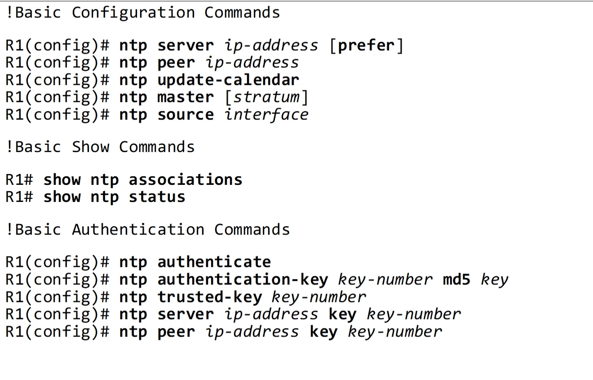


#### Quiz 
1. command to match software clock to hardware clock 
* Ans=> (c) clock read-calendar , clock update-calendar (adjust hardware clock to software)

2. command to configure timezone 
* Ans => (d) R1(config)#clock timezone name offset 

3. show ntp associations 
* Ans => R1(config)# ntp master 9 ===> 127.127.1.1 --> loopback that's why 

4. command to operate router in NTP client mode 
* Ans ==> (c) (config)# ntp server 216.239.35.0

5. must be enabled on NTP client to enable NTP authentication 
* Ans => (c) ntp authenticate, (d) ntp auth-key key-num md5 key, (f) ntp trusted-key key-number
(g) ntp server ip-ad key key-numb

### DNS- Domain Name System 
* The purpose of DNS / Basic functions of DNS 
    * resolve hum-readable names to IP 
    * The DNS server(s) our device uses can be manually configured or learned via DHCP 
    * `> ipconfig /all`
    * cisco Router can act as DNS client and server
    * DNS 'A' record = Used to map names to IPv4 addresses 
    * DNS 'AAAA' record = Used to map names to IPv6 addresses 
    * Standard DNS queries/responses typically use UDP .
    * TCP is used for DNS messages greater than 512 bytes in either case, port 53 is used 
    * DNS cache --> devices will save the DNS server's responses to a local DNS cache.
    * windows dns cache `user> ipconfig /displaydns`
    * windows clear dns cache `user> ipconfig /flushdns`
    * host file `Windows > System32 > drivers > etc `

**configure DNS in cisco IOS** 
* ```
    R1(config)# ip dns server ----> configure R1 to act as a DNS server 
    R1(config)# ip host R1 192.168.0.1 ------> configure a list of hostname/IP address mappings
    R1(config)# ip host PC1 192.168.0.101
    R1(config)# ip host PC2 192.168.0.102
    R1(config)# ip host PC3  192.168.0.103

    R1(config)# ip name-server 8.8.8.8
    ! configure a DNS server that R1 will query if the requested record isn't in its host table 

    R1(config)# ip domain lookup
    !enable R1 to perform DNS queries( enabled by default old version command is ip domain-lookup)
    ```
* `R1# show hosts` --> view configured hosts and host learned via cached DNS 
* Configure cisco router as DNS client 
```
R1(config)# do ping youtube.com
--> unable to resolve
R1(config)# ip name-server 8.8.8.8
R1(config)# ip domain lookup
R1(config)# do ping youtube.com
--> shows result, working
R1(config)# ip domain name jeremysitlab.com ---> optional command 
```
* Command Review 
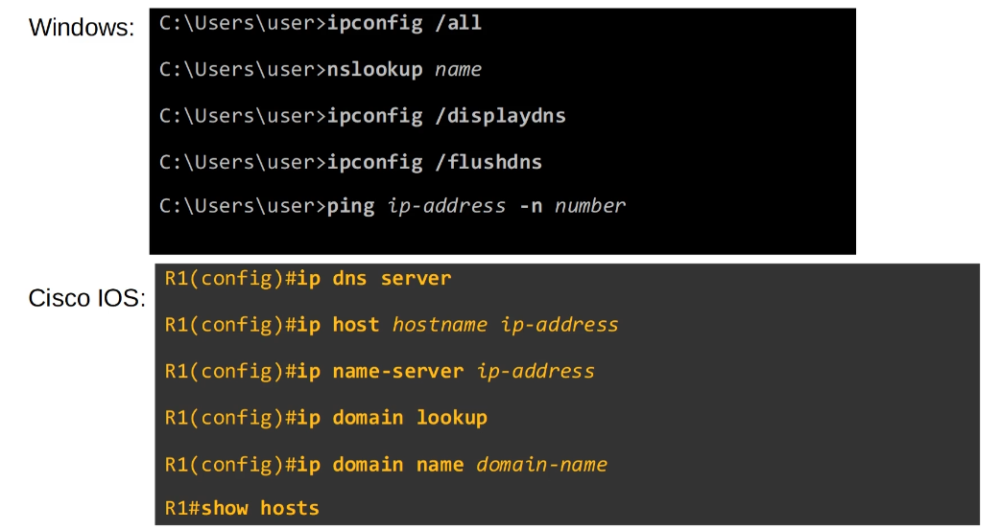

**Quiz**
1. windows command that displays PC's dns server 
    * ipconfig /all
    * nslookup

2. statement about DNS 
    * 'A' records map hostnames to IPv4 addresses 
    * A cisco router can be configured as a DNS server and DNS client at the same time 

3. No DNS configuration are needed on Router when it uses external server , it will simply forward the packet as normal

4. command to show cached name/IP address mappings
    * R1# show hosts 

5. Protocol that hosts can use to automatically learn the address of their DNS server ==> **DHCP**


### DHCP - Dynamic Host Configuration Protocol 

* The purpose of DHCP 
    * allows host to automatically/dynamically learn various aspects of their network configuration such as IP address, subnet mask, default gateway, DNS server, etc without manual/static configuration 
    * It is essenttial part of modern networks 
        * for example when we connect a phone/laptop to WiFi, we don't ask the network admin which IP address, subnet mask, default gateway, etc the phone/laptop should use ? 
    * Typically used for 'client devices' such as workstations(PCS), phones etc 
    * Devices such as routers, servers etc are usually manually configured 
    * In small home networks, the router typically acts as the DHCP server for hosts in the LAN 
    * In larger networks,the DHCP server is usually a Windows/Linux server 

* Basic Functions of DHCP
    * DHCP server 'lease' IP address to clients 
    * `user> ipconfig /release ` --> clear the learned addresses  DHCP release 
    * DHCP server --> UDP 67, DHCP client UDP 68 
    * `user> ipconfig /renew `
    * **Four messages**

        1. DHCP Discover 
            * Broadcast message from client, asking if there are any DHCP servers in the network 

        2. DHCP Offer: Sent from DHCP server to the client, offering an address for client to  use,  as well as other information like default gateway, DNS server etc 
            * Unicast frame , unicast at layer 3
            * src : UDP 67 Dst: UDP 68 ---> reversed from DHCP Discover 
            * DHCP offer message can be either broadcast or unicast 

        3. DHCP Request: DHCP client to server , telling the server that it wants to use the IP address it was offered 
            * broadcast message 
            * src : UDP 68, dst: UDP 67

        4. DHCP ACK: From server to client, 
            * unicast messages 
            * Bootp flag unicast, DHCP ack message can be broadcast or unicast 
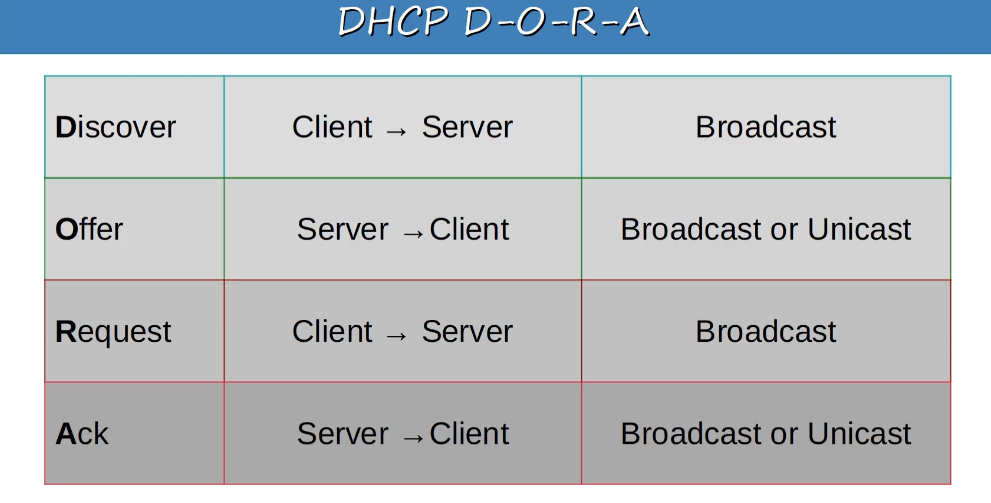
* Configuring DHCP in Cisco IOS - router can be DHCP client/server/DHCP relay agent

**DHCP relay**
* large enterprises often choose to use a centralized DHCP server 
* If the server is centralized, it won't receive the DHCP clients broadcast DHCP messages (broadcast messages don't leave the local subnet)
* To fix this, we can configure a router to act as a DHCP relay agent 
* The router will forward the clients broadcast DHCP messages to the remote DHCP server as unicast messages 

**DHCP server config in IOS**
```
R1(config)# ip dhcp excluded-address 192.168.1.1 192.168.1.10
! specify a range of addresses that won't be given to DHCP clients 

R1(config)#  ip dhcp pool LAB_POOL 
! create a DHHCP pool --> subnet of addresses that can be assigned 
! to DHCP clients as well as other info such as DFG and DNS server 

R1(dhcp-config)# network 192.168.1.0 /24
! specify the subnet of addresses to be assigned to clients (except the excluded addresses)

R1(dhcp-config)# dns-server 8.8.8.8
! specify the DNs server that DHCP clients should use 

R1(dhcp-config)# domain-name google.com
! specift the domain name of the network 
! PC1 = pc1.google.com

R1(dhcp-config)# default-router 192.168.1.1
! specify the default gateway 

R1(dhcp-config)# lease 0 5 30 
! specify the lease time 
! lease days hours minutes OR lease infinite (not recommended)
```

### `R1# show ip dhcp binding`


**DHCP Relay Agent configuration in IOS**
```
R1(config)# interface g0/1
! configure the interface connected to the subnet of the client devices 

R1(config)# ip helper-address 192.168.10.10
! configure the IP address of the DHCP server as the 'helper' address 
! (make sure the address is configured OSPF or static )

R1(config-if)# do show ip interface g0/1
``` 

**DHCP client config in IOS** 
```
R1(config)# interface g0/1
R1(config-if)# ip address dhcp 
! use this command mode to tell the router to use DHCP to learn its IP address 
```

**command Summary**
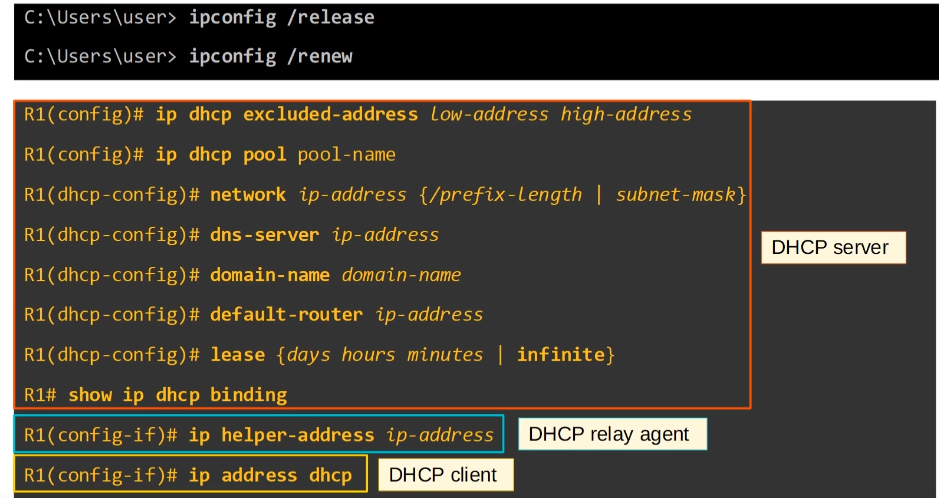

**Quiz**
1. correct order of messages when a DHCP client gets an IP address from a server 
    * (b) DORA:- Discover, Offer, Request, ACK

2. windows command which cause a PC to discover a DHCP Discover message 
    * (d) > ipconfig /renew

3. wireshark messages 
    * (d) 255.255.255.255 
    * Bootp flags: 0x8000 , Broadcast flag (Broadcast)

4. which of the following DHCP messages can be sent using unicast ?
    * DHCP Offer, DHCP Release(unicast) & DHCP Ack

5. situation when we would configure a router as a DHCP relay agent 
    * (a) when the router is not a DHCP server, there are DHCP clients in the router's connected LAN, and there is no other DHCP server in the connected LAN 

### SNMP (Simple Network Management Protocol)
* Overview
    * industry standard framework  (1988)
* **SNMPv1** 
    * RFC 1065 - Structure and identification of management information for TCP/IP based internets 
    * RFC 1006 - Management information base for network management of TCP/IP based internets 
    * RFC 1067 - A simple network management protocol 
    <br>
    * Used to monitor the status of devices, make configuration changes, etc 
    
    * There are two main types of devices in SNMP 
        1. **Managed Devices**
        - Devices being managed using SNMP, like routers and switches 

        2. **Network Management Station (NMS)**
        - The device/devices managing the managed devices above 
        - This is the SNMP server 

**SNMP operations**
* There are three main operations used in SNMP
   1. Managed devices can notify the NMS of events 
   2. NMS can ask the managed devices for information about their current status
   3. NMS can tell the managed devices to change aspects of thier configuration

**SNMP Components**
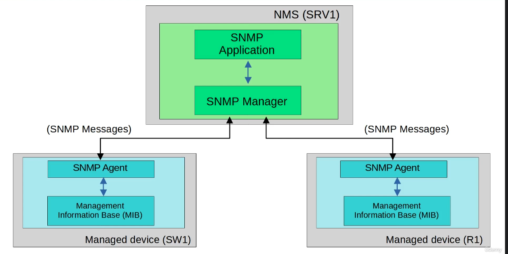

* Green section SNMP software on NMS(PC or server)
    * SNMP Application
        - provides an interface for the network admin to interact with 
            * Displays alerts, statistics, charts  etc (eg. Solarwinds)
            <br>
    * SNMP Manager 
        - The software on the NMS that interacts with the managed devices 
            * It receives notifications, send requests for information, sends configuration changes etc
            <br>

* Blue area:
    * SNMP Agent
        - The SNMP software running on the managed devices that interacts with the SNMP Manager on the NMS 
            * It sends notification to/reveices messages from the NMS 
            <br>
    * Management Information Base (MIB)
        - The structure that contains the variables that are managed by SNMP 
            * Each variable is identified with an **<i>Object ID(OID)</i>**
            * Example variables: Interface status, traffic throughput, CPU usage, temperature, etc 
            <br>
            * SNMP OIDs are organized in a hierarchical structure 

            .1 .  3  . 6  . 1  . 2  . 1  . 1  . 5

            1 -> iso

            3 ->identified organiation

            6 --> dod   

            1 --> internet

            2 --> mgmt

            1 --> mib2

            1 --> system

            5 --> sysName  

* SNMP versions
    * Three main versions:
        1. SNMPv1
            * The original version of SNMP
            <br>

        2. SNMPv2c
            * Allows the NMS to retrieve large amounts of information in a single request, so it is more efficient  
            * c refers to the community strings used as passwords in SNMPv1, removed from SNMPv2 and then added back for SNMPv2c 
            <br>

        3. SNMPv3 
            * A much more secure version of SNMP that supports strong encryption and authentication whenever possible, this version should be used 
            <br>

* SNMP messages 
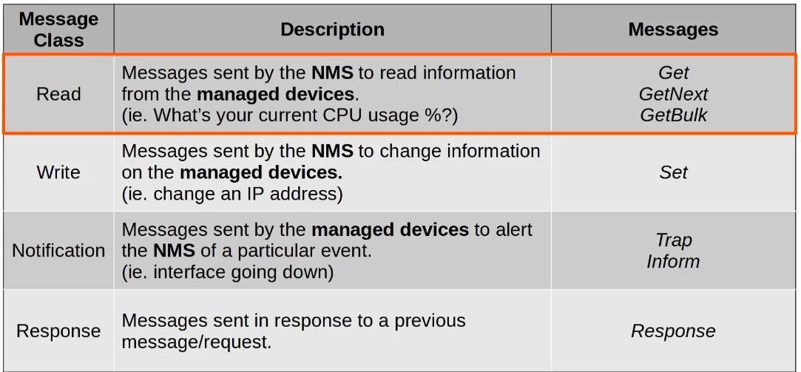

    * Get 
        * A request sent from the manager to the agent to retrieve the value of a variable (OID) or multiple variables. The agent will send a Response message with the current value of each variable
    * GetNext 
        * A request sent from the manager to the agent to discover the available variable in the MIB
    * GetBulk
        * A more efficient version of the GetNext message( introduced in SNMPv2)
    <br>

    * set
        * A request from the manger to the agent to change the value of one or more variables,
        * The agent will send a response message with the new values 
    <br>

    * Trap 
        * Notification from the agent to the manager, the manager doesnot send a response message to acknowledge that it received the Trap, so these messages are 'unreliable'

    * Inform
        * A notification message that is acknowledged with  Response message
        * Originally used for communications between managers, but later updates allow agents to send inform messages to managers, too.
    <br>

<b>

`SNMP Agent = UDP 161`

`SNMP Manager = UDP 162`
</b>

**SNMPv2c configuration (basic)**

```
R1(config)# snmo-server contact sample@gmail.com
R1(config)# snmp-server location Sample House 
! optional information

R1(config)# snmp-server community username ro 
! configure the SNMP community strings(password)
! ro ---> read only -->  no Set message 

Default  ro= public rw=private 

R1(config)# snmp-server community username2 rw
! rw ----> read/write = can use Set message 

R1(config)# snmp-server host 192.168.1.1 version 2c username
! Specify the NMS, version and community 

R1(config)# snmp-server enable traps snmp linkdown linkup
R1(config)# snmp-server enable traps config
! configure the Trap types to send to the NMS 

```
* SNMPv1 & SNMPv2: there is no encryption
    * The community and message contents are sent in plain-text. 
    * This is not secure as the packets can easily be captured and read 

**Quiz**
1. used by NMS to read the information from the managed devices 
* Ans => Get, GetNext, GetBulk
2. SNMP message sent to UDP port 162
* Ans=> Inform , trap (Managed devices )
      Set, Get (UDP port 161)
3. mass retrieval of information, introduces in SNMPv2
* Ans=> GetBulk
4. Software that runs on SNMP NMS 
* Ans=> Manager 
5. SNMP messages sent without expecting a Response
* Ans=> Trap


### The Syslog Protocol -RFC 5424 
**Syslog overview** 
* Protocol for message logging
* changes and interface status 
* can be displayed in CLI, saved in the RAM or sent to an external Syslog server 
* Syslog and SNMP are both used for monitoring and troubleshooting of devices

**Syslog message format ** 
* seq:time stamp: %facility-severity-MNEMONIC:description
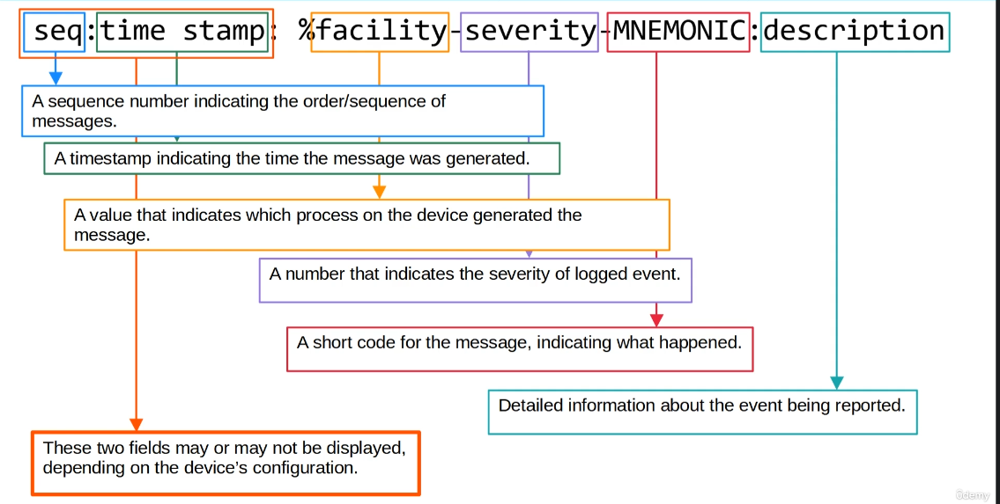

**Syslog facilities and severity levels**

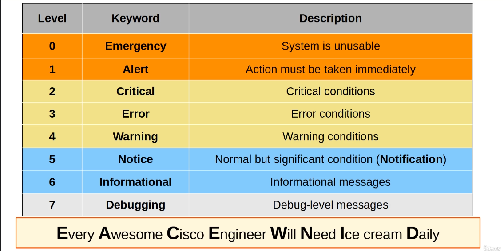

**Syslog logging locations**
* Console line: Syslog message will be displayed in the CLI when connnected to the device via the console port. By default, all messages (level 0 - level 7 are displayed)
<br>
* VTY lines: displayed in CLI when connected to the device via Telnet/SSH, disabled by default 
<br>
* Buffer: messages saved to RAM, all messaged (level 0 - level 7) are displayed
    * `show logging`
<br>
* External server: configure the device to send Syslog message to an external server 
    * syslog servers will listen for messages on UDP port 514.

**Syslog configuration**
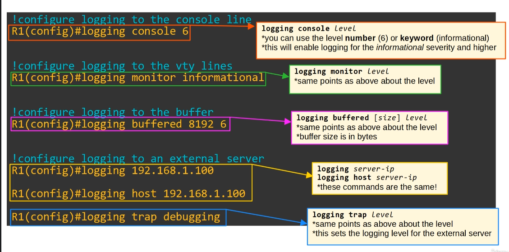

* Even if logging monitor level is enabled, by default syslog messages will not be displayed when connected via telnet or ssh 

* For the messages to be displayed, you must use the following command:

    `R1# terminal monitor`

* This command must be used every time we connect to the devices via telnet or SSH 

**Service timestamps / service sequenve-numbers**
<b>

```
R1(config)# service timestamps log datatime

R1(config)# service sequence-number 

```
</b>
<br>

* Syslog Command Summary 
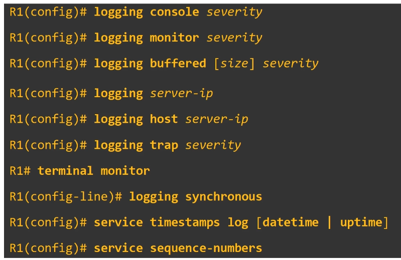

**Syslog vs SNMP** 
* syslog:
    * message logging
    * events occur within the system are categorized based on facility/severity and logged
    * used for system mgmt, analysis and troubleshooting
    * messages are sent from the devices to the server
    * the server can't actively pull information from the devices (like SNMP Get) or modify variables (SNMP set)

* SNMP
    * used to retrieve and organize info about the SNMP managed devices
    * Ip add, current int status, temperature, CPU usage etc
    * SNMP servers can use Get to query the clients and Set to modify varibales on the clients

**Quiz**
1. severity level ..%SYS-5-CONFIG_I:..
    * 5 (Notification)

2. severity level ...%LINK-3-UPDOWN:...
    * 3 (Error)

3. Syslog messages sent to by default 
    * console line
    * Buffer 

4. logging buffered 6
    * Severity 0 to 6

5. syslog message field that might not be displayed 
    * seq
    * time stamp


### SSH- Secure Shell 
**ConsolePort Security**
* By default  No password needed 
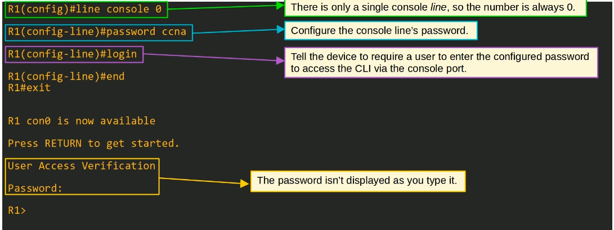

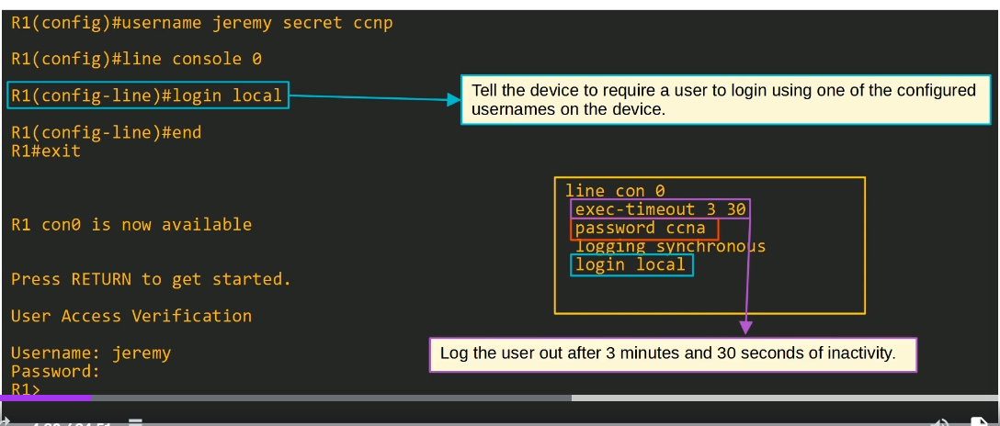

**Layer 2 switch management IP**
* Layer 2 switch don't perform packet routing and don't build a routing table, they are not IP routing aware
* But we can assign an IP address to an SVI to allow remote connections to the CLI of the switch(using telnet or ssh)

```
SW1(config)# interface vlan1
! configure the IP address on the SVI in the same way on multilayer switch

SW1(config)# ip address 192.168.1.253 255.255.255.0
SW1(config)# no shut 
! enable the interface if necessary 

SW1(config)# ip default-gateway 192.168.1.254

```

**Telnet**
* less secure (Teletype Network) developed in 1969
* should use SSH instead of Telnet 
* no encryption, can use wireshark to capture the traffic in plain text 

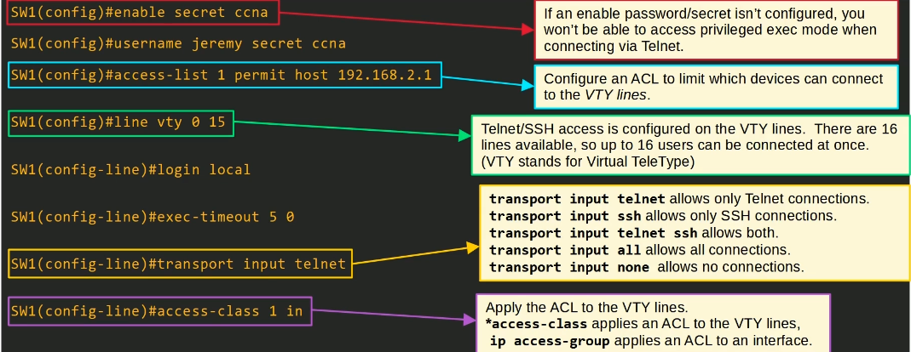

**SSH**
* Secure Shell , 1995 
* SSHv2, 2006
* If devices supports both version 1 and version 2 it is said version 1.99
* More secure and provides data encryption and authentication 
* check ssh support (vios_12-ADVENTERPRISEK9-M)
* Cisco supports NPE(No Payload Encryption) IOS images to countries that have restrictions on encryption technologies 

* NPE IOS images doesnot support cryptographic featurs such as SSH 

**`SW1# show version `**

**`SW1# show ip ssh`**

* RSA at least 768 bits 
* must generate RSA public and private key pair 
* Keys are used for data encryption/decryption, authentication etc 

```
SW1(config)# ip domain name domain.com
! The FQDN of the device is used to name the RSA keys
! FQDM = Fully Qualified Domain Name(host name + domain name )

SW1(config)# crypto key generate rsa 
! size :2048 bits 

or 

SW1(config)# crypto key generate rsa modulus length
! length must be 768bits or greater for SSHv2
```
* restrict SSH to version 2 only 
`SW1(config)# ip ssh version 2`

**SSH configuration**
1. Configure hostname 

`Router(config)# hostname R2`

2. Configure DNS domain name 

`R2(config)# ip domain name company.com`

3. Generate RSA key pair

`R2(config)# crypto key generate rsa`

4. Configure enable PW, username/PW

5. Enable SSHv2 only 
6. configure VTY lines 

**`ssh -l username ip-address OR ssh username@ip-address`**

**SSH Command Summary**

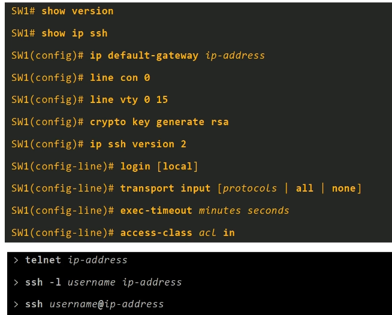

**Quiz**
1. crypto key generate rsa command rejected 
    * hostname hasn't been configured
    * a DNS domain name hasn't been configured 

2. both telnet and ssh to be used 
    * transport input telnet ssh
    * transport input all 

3. allow only 192.168.1.1 to connect to R1 via SSH 
    * access-list 199 permit tcp host 192.168.1.1 any eq 22 
    * line vty 0 15 
    * access-class 199 in

4. True SSH statements 
    * (F) a key length of at least 768 bits is required for SSHv2
    *  (b) K9 IOS images support SSH

5. A netowrk admin  using PC1 is remotely configuring SW1 by connecting to the CLI of SW1 via SSH. What is the role of SW1 in this situation ?
    * SSH server 

### FTP and TFTP 
**The purpose of FTP/TFTP**
* File Transfer Protocol and Trivial File Transfer Protocol are industry standard protocols
* Uses client-server model 
    * clients can user FTP or TFTP to copy files from a server
    * cliens can user FTP or TFTP to copy file to a server 
* most common use is while upgrading the OS of a network device 
* can use it to download the newer version of IOS from a server and then reboot the device with the new IOS image 


**FTP/TFTP functions and differences**
* TFTP first standardized in 1981
* It is simple and has only the basic features compared to FTP 
    * only allows a client to copy a file to or from a server 
* was released after FTP, but is not a replacement for FTP
* It is another tool to use when lightweight simplicity is more important than functionality 
* No authentication, so servers will respond to all TFTP request 
* No encryption, so all data is sent in plain text 
* Best used in a controlled environment to transfer small files quickly 
* TFTP servers listen on **UDP port 69**
* TFTP has similar built in features within the protocol itself 

**TFTP Reliability**
* send ACK messages 
* timers are used,  so that it can resend data after certain time 
* TFTP uses 'lock-step' communication, the client and server alternately send a message and then wait for a reply.(+retransmissions are sent as needed)

**TFTP connections**
* 3 phases 
    1. connection : 
        * client sends a request to the server and the server responds back, initializing the connection
    2. Data transfer: 
        * the client and server exchange TFTP messages
        * One sends data and the other sends acknowledgement 
    3. Connection termination
        * After the last data message has been sent a final acknowledgement is sent to terminate the connection

**FTP**
* first standardized in 1971
* FTP uses TCP port 20 and 21 
* Usernames and passwords are used for authentication, however no encryption
* for greater security, FTPS (FTP over SSL/TLS) can be used --upgrade to FTP 
* SSH file Transfer protocol (SFTP) can also be used for greater security 
* FTP is more complex the TFTP and allows not only file transfers, but clients can also navigate file directories, add and remove directories, lst files, etc 
* The clients sends FTP commands to the server to perform these functions 

* FTP uses two types of connection that's why it uses two different ports 
    * FTP control TCP 21 -> to send FTP commands 
    * FTP data TCP 20 --> for data or files transfer 
    * the default method of establishing FTP data connection is active mode, in which the server initiates the TCP connection
    * in FTP passive mode the client initiates the data connection, this is often necessary when the client is behind a firewall, which could block the incoming connection from the server 

    * **Firewall usually don't permit outside devices to initiate connection. In this case, FTP passive mode is used and the client(behind the firewall) initiates the TCP connection**


**IOS file systems**
* File system is a way of controlling how data is stored and retrieved 
* Command to view file systems of a cisco IOS devices 

    **`Router# show files systems`**
    * disk :- storage devices such as flash
    * opaque :- used for internal functions
    * nvram :- internal NVRAM. The startup-config file is stored here
    * network :- Represents external file systems, for example external FTP/TFTP servers 

**Using FTP/TFTP in IOS**
* command to show the IOS version

    **`Router1# show version `**

* command to show the content of the flash

    **`R1# show flash `**

sample output: c2900-universalk9-mz.SPA.151-4.M4.bin

* Copying files 
**`R1# copy tftp: flash:`**
    * copy src dst 
    * enter the TFTP server IP 
    * enter the filename on the server 
    * enter the name you want to save it as on flash (*hit enter for the default*)

* Upgrading Cisco IOS 

<b>

```
R1(config)# boot system flash:c2900-universalk9-mz.SPA.151-4.M4.bin

R1(config)# exit
R1(config)# write
R1(config)# reload

R1# show version

R1# delete flash:c2900-universalk9-mz.SPA.151-4.M4.bin

R1# show flash
```
</b>

* *boot system filepath* 

**Copying Files(FTP)**
<b>

```
R1(config)# ip ftp username cisco
R1(config)# ip ftp password ccna
R1# copy ftp:flash
```

</b>

* command summary 

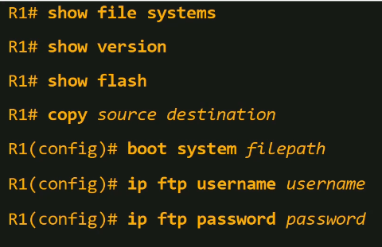

**Quiz**
1. True statements about FTP 
    * FTP data - TCP 20
    * FTP control -TCP 21

2. command to transfer file from external TFTP server to local device's flash storage
    * copy tftp: flash:

3. R1 is behind the firewall and wants to connect to an external FTP server 
    * FTP passive mode for the data connection should be used

4. Used to store the startup-config of a device running Cisco IOS 
    * NVRAM

5. Following function not possible when using TFTP 
    * Create a new directory on a server
    * List the contents of a server 


### Network Address Translation (NAT)
**Private IPv4 addresses**
* RFC 1918 
* Three main short term solutions 
    * CIDR 
    * Private IPv4 addresses 
    * NAT 
* RFC 1918 specifies the following IPv4 address ranges as private :

<br>

    * 10.0.0.0/8 (10.0.0.0 to  10.255.255.255) ------> Class A

    * 172.16.0.0/12 (172.16.0.0 to 172.31.255.255)------> Class B

    * 192.168.0.0/16 (192.168.0.0 to 192.168.255.255)--------> Class C 

</br>

* they don't have to be globally unique 

**Intro to NAT**
* used to modify src and/or dst IP addresses of packets 
* the common reason is to allow hosts with private IP addresses to communicate with other hosts over the internet
* **source NAT**

* statically configuring one-to-one mappings of private IP addresses to public IP addresses 
* An inside local IP address is mapped to an inside global IP address
    * inside local : 
        * IP address of the inside host, from the perspective of the local network
        * The ip address actually configured on the inside host, usually a private address 

    <br>

    * inside global
        * The ip address of the inside host, from the perspective of outside hosts
        * the ip address of the inside host after NAT, usually a public address 

    <br>

    * outside local
        * The ip address of the outside host, from the perspective of the local network

    <br>

    * Outside Global
        * The ip address of the outside host, from the perspective of the outside Network

    <br>


* Static NAT allows devices with private IP addresses to communicate over the internet 
* But as it requires a one-to-one IP address mapping, it doesn't help preserve IP addresses 

**Static NAT configuration**

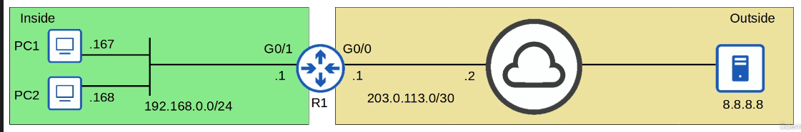

<b>

```

R1(config)# int g0/1
R1(config-if)# ip nat inside 
! define inside interfaces connected to the internal network

R1(config-if)# int g0/0
R1(config-if)# ip nat outside 
R1(config-if)# exit 
! define the outside interfaces connected to the external network 


R1(config)# ip nat inside source static 192.168.0.167 100.0.0.1
R1(config)# ip nat inside source static 192.168.0.168 100.0.0.2
R1(config)# exit
! configure 1-1 IP address mappings 
! ip nat inside source static inside-local-ip inside-global-ip

R1# show ip nat translations
```
</b>

* Clear ip nat translation

    **`R1# show ip nat translations`**

    **`R1# clear ip nat translation *`**

    **`R1# show ip nat statistics`**

**Quiz**
1. command to static source NAT mapping of 192.168.10.10 to 203.0.113.10
    * ip nat inside source static 192.168.10.10 203.0.113.10

2. ip nat inside source static 10.0.0.1 20.0.0.1 and ip nat inside ...10.0.0.2 20.0.0.1
    * only 10.0.0.1 will be translated to 20.0.0.1

3. R1# show ip nat stat
Result => Total active translations: 7 (3 static, 4 dynamic; 0 extended)
How many active translations will be there if we issue clear ip nat trans*
    * 3

4.  ipv4 private address 
    * 10.254.255.0
    * 172.20.2.3
    * 10.11.12.13

5. Packet flows and IP
    * outside Global :8.8.8.8
    * outside local : 8.8.8.8
    * inside local: 172.20.0.101
    * inside global: 200.0.0.1

### NAT - Dynamic NAT Part 2
**Dynamic NAT**
* Static NAT -- statically configuring one-to-one mapping of private IP addresses to public addresses 

* Dynamic NAT -- the router dynamically maps inside local addresses to inside global addresses as needed 
* ACL is used to identify which traffic should be translated 
    * src ip is permitted, then src ip is translated 
    * if src ip is denies, the src ip is not translated 
* NAT pool is usedto define the available inside global addresses
* Mapping is still one-to-one (one inside local IP per global IP)
* if there are no enough global IP (all are currently being used), it is called NAT pool exhaustion
    * dynamic NAt entries will time out automatically if not used or we can clear them manually 
* Dynamic NAT default timeout is 24hrs 
* Configuration 
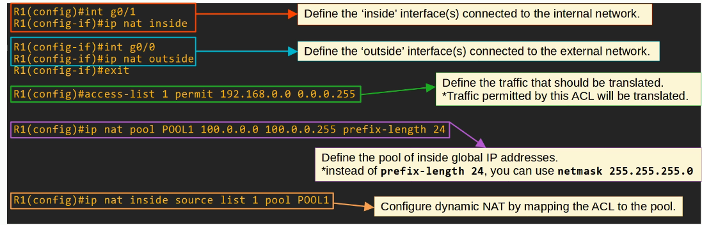

**Dynamic PAT (Port Address Translation)**
*  aka NAT overload, translates both the IP and the port number( if neccessary)
*  unique port for each communication flow, a single public address can be used by different internatl hosts 
    * port number are 16 bits => 65,000 available port numbers
* The router will keep track of which inside local address is using which inside global address and port 
* As many inside hosts can share a single public IP, PAT is very useful for preserving public IP addresses, and it is used in networks all over the world 

* **PAT is most widely used**

* Configuration 
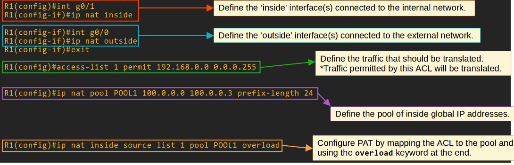

<br>

**Command Summary**

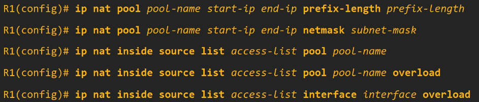

**Quiz**
1. Best NAT types which help in preserving public IPv4
    * NAT overload

2. Translate inside local addresses from 172.16.1.0/24 to addreses from the subnet 203.0.113.0/25
    ```
    access-list 1 permit 172.16.1.0 0.0.0.255
    ip nat pool POOL1 203.0.113.0 203.0.113.127 netmask 255.255.255.128

    ip nat inside source list 1 pool POOL1

    interface g0/0
    ip nat inside

    interface g0/1
    ip nat outside
    ```
3. what happens if all 10 addresses are being used by inside hosts 
    * It discards the packet 

4. 10.0.1.0/27 to use the IP address of the router's G0/1 interface 
    ```
    access-list 1 permit 10.0.1.0 0.0.0.31
    ip nat inside source list 1 interface gigabitethernet0/1 overload

    interface g0/0
    ip nat inside

    interface g0/1
    ip nat outside 

    ```
5. access-list 1 deny 192.168.1.0 0.0.0.255, what happens to 192.168.1.0 in NAT
    * The packets they send will noe be translated by R1

    
### Quality of Service (QoS)
**IP Phones/Voice VLANs**
* Traditional phone PSTN:- Public Switched Telephone Network 
* Also called POTS (Plain Old Telephone Service)
* IP phone uses VoIP (Voice Over IP) technologies to enable calls over an IP network, such as the Internet 
* IP phone have an internal 3-port switch
    * 1 port is the 'uplink' to external switch
    * 1 port is the 'downlink'  to the PC
    * 1 port connects internally to the phone itself 
*  PC and the IP phone to share a single switch port
* Traffic from the PC passes through the IP phone to the switch 
* Recommended to separate 'voice' traffic (from the IP phone) and data traffic (From the PC ) by placing them in separate VLANs
    * voice VLAN
    * traffic from the PC will be intagged, but traffic from the phone will be tagged with a VLAN ID 

    ```
    SW1(config)# interfave gigabitethernet0/0
    SW1(config)# switchport mode access
    SW1(config)# switchport access vlan 10

    SW1(config)# switchport voice vlan 11
    ! PC1 will send traffic untagged, as normal SW1 will use CDP to tell PH1 to tag
    PH1's traffic in VLAN 11

    SW1# show interfaces g0/0 switchport 
    ! even though interface sends/receives traffic from two VLANs it is 
    not considered a trunk port. It is considered an access port 

    ```

**Power Over Ethernet (PoE)**
* Power Sourcing Equipment (PSE) to provide power to Powered Devices (PD) over an Ethernet
* typically PSE is a switch and the PDs are the IP phones, IP cameras, wireless access points etc 
* The PSE receives AC power from the outlet, converts it to DC power, and supplies that DC power to the PDs
* PoE has a process to determine if a connected device needs power and how much power it needs 
    * when a device is connected to a PoE enabled port the PSE switch sends low power signals, monitors the response, and determines how much power the PD needs 
    * if the device needs power the PSE supplies the power to allow the PD to boot
    * The PSE continues to monitor the PD and supply the required amount of power(but not too much)
* Power Policing can be configures to prevent a PD from taking too much power 
    * `power inline police`  configures power policing with the default settings: disable the port and send a Syslog message if a PD draws too much power
        * equivalent to `power inline police action err-disable` 
        * the interface will be put in an 'error-disabled' state and can be re-enabled with **shutdown** followed by **no shutdown**

    <br>

    * `power inline police action log` does not shut down the interface if the PD draws too much power. IT will restart the interface and send a Syslog message

    **Preventing PD's from drawing too much power**

**Intro to Quality of Service(QoS)**
* Voice traffic and data traffic used to use entirely separate networks 
    * voice traffic used the PSTN 
    * Data traffic used the IP network (enterprise WAN, internet, etc)
* QoS wasn't necessary as the different kinds of traffic didn't complete for bandwidth
* modern network shares the same IP network 
* **QoS is a set of tools used by network devices to apply different treatment to different packets**
*  manage following characteristics of network traffic :
    1. Bandwidth 
        * Kbps, Mbps, Gbps etc 
        * reserve a certain amount of a link's bandwidth for specific kinds of traffic, example 20% voice traffic, 30 % for specific kind of data traffic, leaving 50 % for other traffic
    2. Delay 
        * one-way delay (src- dst)
        * two-way delay (src-dst and return )
    3. Jitter 
        * variation in one-way delay between packets sent by the same applicaiton
        * IP phones have a 'jitter buffer' to provide a fixed delay to audio packets.
    
    4. Loss 
        * the % of packets sent that do not reach their destination
        * faulty cables, queues get full and the device starts discarding packets

* 1-way delay : 150 ms or less
* Jitter: 30 ms or less
* Loss: 1% or less

**QoS Queuing**
* queued messages will be forwarded in FIFO manner 
* Queue full new packets dropped => tail drop 
* TCP global Synchronization:
    * TCP sliding window 
    * increase/decrease the rate at which they send traffic as needed 
    * when a packet is dropped it will be re-transmitted
    * when a drop occurs, the sender will reduce the rate it sends traffic 
    * It will then gradually increase the rate again 

    <br>

    Network Congestion ---> Tail Drop -------> Global TCP window size decrease ----> Network underutilized -------> Global TCP window size ---> Network congestion again

* Random Early Detection (RED) ---> solution to prevent tail drop 
* when the amount of traffic in the queue reached a certain threshold, the device will start randomly dropping packets from select TCP flows 
* improved version , Weighted Random Early Detection (WRED) allows us to control which packetd are dropped depending on the traffic class 

**Quiz**
1. -Voice traffic tagged in VLAN 99, data traffic untagged 
2. The interface will be err-disabled and a Syslog message will be generated --> `power inline police`
3.  Delay 150 ms or less, Jitter 30 ms or less, Loss: 1% or less 
4. TCP global Sync
5. FIFO is the default manner of forwarding queued packets 

### Quality of Service (Part 2)
**Classification/Marking**
* organizes network traffic (packets) into traffic classes (categories)
* we have to identify which types of traffic to give priority to
* Many methods of classifying traffic
    * like ACL 
    * NBAR: Network Based Application Recognition : performs a deep packet inspection, looking beyond Layer 3 and Layer 4 information up to Layer 7 to identify the specific kind of traffic 
    * In Layer 2 and Layer 3 headers there are specific fields used for this purpose 
* PCP (Priority Code Point) field of the 802.1Q tag (in the Ethernet header) can be used to identify high/low priority traffic 
    * Only when there is a dot1q tag 
* DSCP (Differentiated Services Code Point) field of the IP header can also be used to identify high/low priority traffic 
* PCP i also known as CoS (Class Of Service). It use is defined by IEEE 802.1p
* 3 bits = 8 possible values (2^3 = 8)

<b>

```
 PCP Value             ||      Traffic Types     `
    0                           Best effort (default)
    1                           Background
    2                           Excellent effort
    3                           Critical Applications
    4                           Video
    5                           Voice 
```

</b>

* IP phones mark call signaling traffic (used to establish calls) as PCP3
    * They mark the actual voice traffic as PCP5

* As PCP is found in the dot1q header, it can only be used over the following connections:
    1. trunk links
    2. access links with a voice VLAN

* RFC 2474 defines the DSCP field 
* We should be aware of the following standard markings:
    * Default Forwarding (DF) - best effor traffic 
        * It is used for best-effort traffic 
        * The DSCP marking for DF is 0
        * 000000

    * Expedited Forwarding (EF) - low loss/latency/jitter traffic(usually voice)
        * Used for traffic that requires low loss/latency/jitter 
        * The DSCP marking for EF is 46
        * Binary 101110
    
    * Assured Forwarding(AF) - A set of 12 standard values
        * Defines four traffic classes, all packets in a class have the same priority 
        * Within each class, there are three levels of drop precedence 
            * Higher drop precedence = more likely to drop the packet during congestion
            * 0/1 0/1 0/1(class) 0/1 (drop precedence) 0/1 (always 0)  ==> AFXY 
            * X -----> Decimal number of class , Y is decimal number of Drop precedence
            * Binary 001010
            * 32 | 16 | 8 | 4 | 2  | 0--> DSCP (8X + 2Y)
            * 4  | 2  | 1 | 2 | 1  | 0 ---> AF 

    * Class Selector(CS) - A set of 8 standard values, provides backward compatibility with IPP 
        * 3 bits that were added for DSCP values are set to 0, and the original IPP bits are used to make 8 values 
        * 32    |    16    |  8   |   4     |    2
        * 0/1   |   0/1    |  0/1 |   0     |    0    | 0
        * 0     |     1    |   2  |   3     |    4    | 5  |   6   |   7 ---> IPP
        * CS0   |    CS1   |  CS2 |  CS3    |   CS4   | CS5 |  CS6 | CS7 ====> CS
        * 0     |    8     |   16 |  24     |   32    |  40 |  48  |  56 -----> DSCP (decimal)

    * **RFC 4954** was developed with the help of Cisco to bring all of these values together and standardize their use 
    * The RFC offers many specific recommendations, but here are a few key ones :
        1. Voice traffic: EF
        2. Interactive Video: AF4x
        3. Streaming video: AF3x
        4. High Priority data: AF2x
        5. Best effort: DF 
        
    * `R1(config)# class-map TEST`

**Trust Boundaries**
* defines where devices trust/don't trust the QoS markings of received messages 
* If markings are trusted, the device will forward the message without changing the markings
* If markings aren't trusted, the device will change the markings according to the configured policy 
* if an IP phone is connected to the switch port, it is recommended to move the trust boundary to the IP phones
* This is done via configuration on the switch port connected to the IP phone
* If a user marks their PC's traffic with a high priority, the marking will be changed (not trusted)

**Queuing/Congestion Management**
* The device is only able to forward one frame out of an interface at once, so a scheduler is used to decide which queue traffic is forwarded from next 
    * Prioritization allows the scheduler to give certain queues more priority than others 

    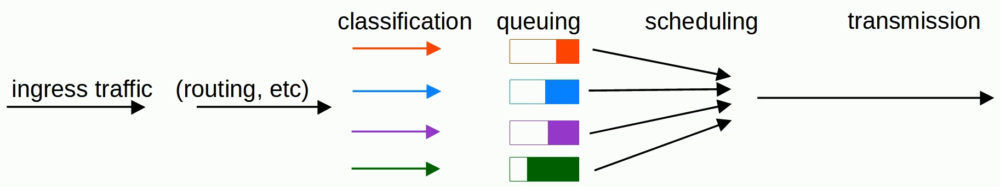

* A common scheduling method is weighted round-robin
    * round-robin == packets are takedn from each queue in order, cyclically 
    * weighted == more data is taken from high priority queues each time the scheduler reached that queue 

* CBWFQ(Class-Based Weighted Fair Queuing) is a popular method of scheduling, using a weighted round-robin scheduler while guaranteeing each queue a certain percentage of the interface's bandwidth during congestion 

* Round-Robin scheduling is not ideal for voice/video traffic 

* LLQ (Low Latency Queuing) designates one (or more) queues as strict priority queues

* This is very effective for reducing the delay and jitter of voice/video traffic 

* Downside of starving other queues if there is always traffic in the designated strict priority queue
    - Policing can control the amount of traffic allowed in the strict priority queue so that it can't take all of the link's bandwidth 


**Shaping/Policing**
* traffic shaping and policing are both used to control the rate of traffic 
* Shaping buffers traffic in a queue if the traffic rate goes over the configured rate 
* Policing drops traffic if the traffic rate goes over the configured rate 
    * Burst traffic over the configured rate is allowed for a short period of time 
    * the amount of burst traffic allowed is configurable 


**Quiz**
1. CoS markings consistent with standard practice 
    * Best effort = CoS 0
    * Voice = CoS 5
    * Video = CoS 4

2. bit pattern in DSCP field of a packet marked as EF 
    * 101 110

3. AF markings that provides the best service 
    * AF 41 

    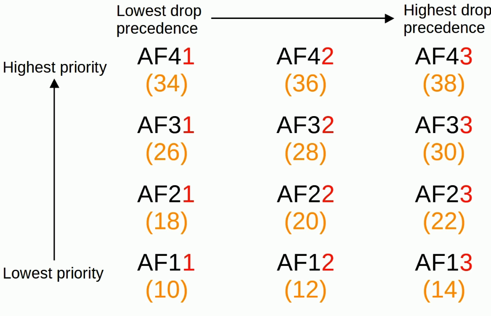

4. General Best Practice regarding QoS 
    * Trust markings from IP phones, Don't trust markings from PCs

5. Creates a strict priority queue for data that requires low delay/jitter/loss
    * LLQ (Low Latency Queuing)

### Security Fundamentals
**Key Security Concepts**
* CIA Triad:- 
    * Confidentiality : 
        * only authorized users should be able to access data
        * Some information/data is public and can be accessed by anyone, some is secret and should only be accessed by specific people
    * Integrity
        * Data should not be tampered with (modified) by unauthorized users
        * Data should be correct and authentic 
    * Availability
        * The network/systems should be operational and accessible to authorized users
    
<br>

* A vulnerability is any potential weakness that can compromise the CIA of a system/info
    * A potential weakness isn't a problem on its own

* An exploit is something that can potentially be used to exploit the vulnerability
    * Something that can potentially be used as an exploit isn't a problem on it's own 

* A threat is the potential of a vulnerability to be exploited 
    * A hacker exploiting a vulnerability in your system is a threat

* A mitigation technique is something that can protect against threates 
    * client devices, switches, routers, firewall, etc 

<br>
  
**Common attacks**
* DoS (denial-of-service) attacks
    * threaten the availability of a system 
    * TCP SYN flood 
        * SYN | SYN-ACK | ACK
        * The attacker sends countless TCP SYN messages to the target 
        * The target sends a SYN-ACK message in response to each SYN it receives
        * The attacker never replies with the final ACK of the TCP three-way handshake
        * The incomplete connections fill up the target's TCP connection table 
        * The target is no longer able to make legitimate TCP connections
    * Distributed Denial-Of-Service attack, the attacker infects many target computers with malware and uses them all to initiate a denial-of-service attack (**botnet**)
    
    <br>

* spoofing attacks ---> Availability 
    * use fake source address (IP or MAC address)
    * Numerous attacks involve spoofing
    * DHCP exhaustion attack
    * Attacker uses spoofed MAC addresses to flood DHCP Discover message 
    * The target server's DHCP pool becomes full, resulting in a denial-of-service to other devices

    <br>

* Reflection/amplification attacks 
    * The attacker sends traffic to a reflector and spoofs the source address of its packets using the target's IP address
    * The reflector (i.e a DNS server) sends the reply to the taget's IP address
    *  A reflection attack becomes an **amplification** attack when the amount of traffic sent by the attacker is small, but it triggers a large amount of traffic to be sent from the reflector to the target 
    
    <br>

* Man-in-the-middle attacks (Confidentiality and Integrity)
    * attacker places himself between the src and dst to eavesdrop on communication or to modify traffic before it reaches the destination
    * Common example is ARP spoofing, also known as ARP poisoning
    * A host sends an ARP request, asking for the MAC address of another device
    * The target of the request sends an ARP reply informing the requestor of its MAC address 

    <br>

* Reconaissance attacks
    * Used to gather information about a target which can be used for a future attack 
    * This is often publicly available information
    * i.e nslookup to learn the IP address of a site 
    * `$ nslookup visa.com`
    * or WHOIS query to learn email addresses, phone numbers, physical addresses, etc 
    
* Malware 
    * malicious software , harmful program that can infect a computer 
    * viruse infect software  (a 'Host program'), spread as the software is shared by the user 
    * worms do not require a host program, they are standalone malware and they are able to spread on their own, without user interaction, can congest the network but the 'paylod' of a worm
    * Trojan Horses, harmful software that is disguised as legitimate software , they spread through user interaction such as opening email attachments or downloading a file from the internet 


* Social Engineering attacks
    * psychological manipulation to make the target reveal confidential information or perform some action
    * Phisiing
        * fraudulent emails that appear to come from a legitimate bussiness 
        * contain links to a fraudulent website that seems legitimate 
        * **spear phising** is more targeted form of phising, i.e aimed at employee of a certain company 
        * **whaling** is phishing targeted at high profile individuals, i.e a company president 
    * Vishing (voice phishing) is phishing performed over the phone 
    * Smishing (SMS phishing)
    * Watering hole attacks compromise sites that target the victim frequently visits. If a malicious link is placed on a website the target trusts, they might not hesitate to click it 
    * Tailgating attacks involve entering restricte, secured areas by simply walking in behind an authorized person as they enter 

* Password-related attacks
    * uername/password 
    * Attackers can learn a user's password via multiple methods
        * Guessing
        * Dictionary attack 
        * Brute Force attack: possible combination of letters, numbers and special characters to find the target's password 

        <br>

        

**Passwords/Multi-Factor Authentication(MFA)**
* Providing more than just a username/password to prove your identity

* Somthing you know 
    * a username/password combination, a PIN etc
 * Something you have 
    * pressing notifcation on phone or a badge that is scanned 
* Somthing  you're 
    * biometrics such as a face scan, palm scan, fingerprint scan, retina scan etc 
* **digital certificates** are another form of authentication used to prove the identity of the holder of the certificate
* they are used for websites to verify that the website being accessed is legitimate 
* certificate signing Request to CA (certificate Authority) which will generate and sign the certificate 

**Authentication, Authorization, Accounting(AAA)**
* Framework for controlling and monitoring users of a computer system (i.e a network)
* Authentication 
    * process of verifying a user's identity 
    * logging in (ideally using MFA) ==> authentication
* Authorization 
    * process of granting the user the appropriate access and permissions.
    * granting the user access to some files/services, restricting access to other files/services = authorization 
* Accounting 
    * process of recording the user's activities on the system 
    * logging when a user makes a changes to a file => accounting 
* Enterprises typically use a AAA server to provide AAA services 
    * ISE(Identity Services Engine) is Cisco's AAA server 

* AAA servers usually support the following two AAA protocols
    1. RADIUS: an open standard protocol. Uses UDP ports 1812 and 1813
    2. TACAS+ : A cisco propriety protocol. Uses TCP port 49

**Security Program Elements**
* set of security policies and procedures 
* User awarness programs are designed to make employees aware of potential security threats and risks 
    * false phising emails 
* User training programs
    * more formal than user awareness programs 
    * corporate security policies 
    * how to create strong passwords, and how to avoid potential threats 
* Physical access control
    * protects equipment and data from potential attackers by only allowing authorized users into protected areas such as network closets or data center floors 
    * **multifactor loks** can protects access to restricted areas 
        * i.e door that requires users to swipe a badge and scan their fingerprint to enter 
        * permissions of the badge can be easily changed, for eg. permissions can be removed when an employee leaves the company 

**Quiz**
1. CIA triad ensures the systems are running and accessible by user 
    * Availability 

2. Real possibility that a potential weakness is taken advantage of to attack a system 
    * Threat 

3. Door locks that require a badge to be scanned and pass code to be entered, this is example of :
    * Physical Access Control 
    * MFA 

4. Not an example of MFA 
    * Doing a retina scan and then doing a fingerprint scan

5. Accounting in AAA model 
    * Logging the date and time a user logged in to the system 

#### Kali Linux Demo 
* attacker use all of the dhcp pool addresses and the other users cannot get ip address assigned 

```
R1# sh run | sec dhcp 

R1# sh ip dhcp pool

R1# sh ip dhcp binding 

R1# clear ip dhcp binding *

```
#### Port Security 
**Intro to port security**
* Security feature of Cisco Switches 
* allows us to control which source MAC address(es) are allowed to enter the switchport 
* If an unauthorized source MAC address enters the port, an action will be taken
    * default action is to place the interface in an 'err-disabled' state 
* when we enable port security on an interface with the default settings, one MAC address is allowed
    * we can configure the allowed MAC address manually 
    * if we don't configure it manually the switch will allow the first source MAC address that enters the interface 
    * We can change the maximum number of MAC addresses allowed 

**Why we use port security**
* Allows network admin to control which devices are allowed to access the network 
* However, MAC address spoofing is a simple task
    * it is easy to configure a device to send frames with a different source MAC address 
* Rather than manually specifying the MAC addresses allowed on each port, port security's ability to limit the number of MAC addresses allowed on an interface is more useful 
* DHCP starvation attack 
    * the attacker spoofed thousands of fake MAC addresses 
    * the DHCP server assigned IP addresses to these fake MAC addresses, exhausting the DHCP pool
    * switch's MAC address table can also become full due to such an attack 
* So, limiting the number of MAC addresses on an interface can protect against those attacks 

**Port security configuration**
* enabling port security 

```
SW1(config)# interface g0/1

SW1(config-if)# switchport port-security 
! cmd rejected: GigabitEthernet0/0 is a dynamic port 

SW1(config-if)# do sh int g0/1 switchport 
!Name: Gi0/1
Switchport: Enabled
Administrative Mode: dynamic auto
Operational Mode: static access 

* port security only on access or trunk not in dynamic auto or desirable 

SW1(config-if)# switchport mode access

SW1(config-if)# do show int g0/1 switchport
!Name: Gi0/1
Switchport: Enabled
Administrative Mode: static access
Operational Mode: static access 

SW1(config-if)# switchport port-security 

SW1# show port-security interface g0/1
```

* re-enabling an interface(manually)
    1. disconnect the unauthorized device 
    2. shutdown and then no shutdown the interface

    ```
    SW1(config)# interface g0/1
    SW1(config-if)# shutdown
    SW1(config-if)# no shutdown     
    ```
* re-enabling an interface (ErrDisable Recovery)

`SW1# show errdisable recovery`
