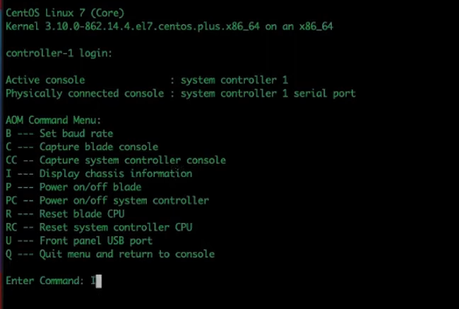
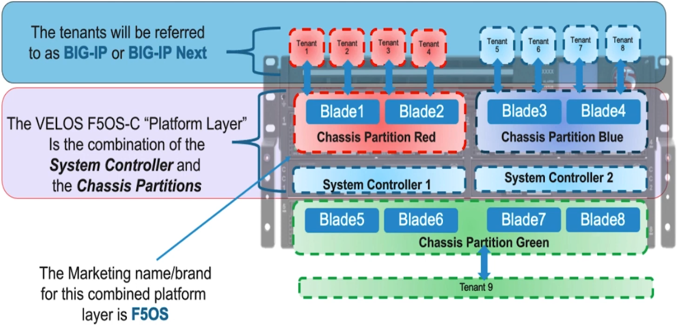

### F5 VELOS Setup

* Console to the System Controller and ensure that we are in Active SC 
    - Option 1 check LED on SC 
    - Option 2 Access the AOM menu:
        - On telnet, hold ESC shift and 9 

        

* Change admin password and root password 
* Run VELOS setup wizard 

    `[root@controller-1 ~]# velos-setup-wizard`

* Setup management IP addresses for controller 1 -x.x.x.x
* Setup management IP addresses for controller 2 -x.x.x.x
* Setup Floating Management IP address- x.x.x.x

#### Chassis Partition 
* Virtual System 

* System Upgrades : before proceeding we need to make sure that we are running the latest version of the software in order to do that we can navigate to downloads.f5.com and Find latest version of F5OS

* F5 recommends that we upgrade the system controllers first then update the version of the software on the chassis partition 

* Access the velos system using the floation IP address configured above.

* Command to find floating IP via cli 

    `syscon-2-active# show system mgmt-ip`

* After uploading the software image to controllers and partition it may take some time at images are replicated on the standby controller once it's completed on the active system controllers.
    - From UI: Software Management >> Partition Images and Controller Images 

#### Backing up F5OS Configurations 

* To completely backup each tenant's we need to bacup
    - Each TMOS configuration 
    - Each F5OS chassis partition configuration 
    - F5OS system controller cofiguration 

* At chassi level F5OS configuration data includes dns, ntp server setting, Auth server , logging, HA, product licensing etc 
    - System Setting >> configuration Backup >> Name ___ >> create 

    