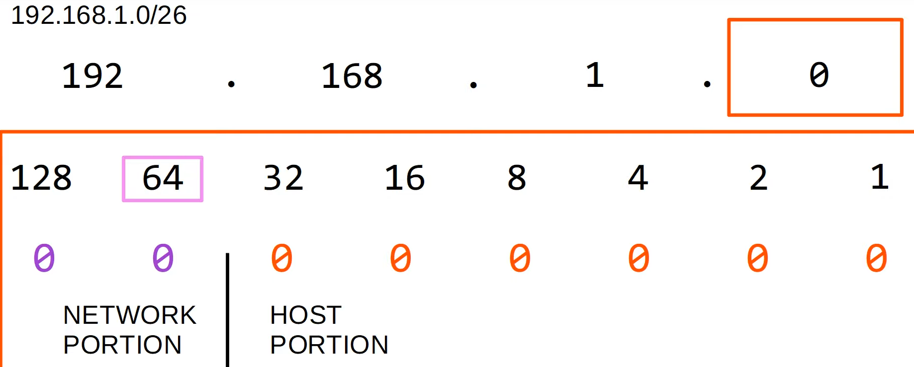

### Subnetting Process 
1. Number of usable address = $2^n-2$ , n--> number of host
for example :
    `203.0.113.0/27`
    `11001011.00000000.01110001.00000000`
    `/27--> 3 bits borrowed so remaining is 5`

    $2^5-2=32-2 = 30$

2. Broadcast Address 
    * Convert to binary
    * Network Portion, borrowed bits, host portion
    * Set all host bits to 1
    * DDN => broadcast address 
    * Network of another subnet => 1 more thatn broadcast address 

3. Network Address 
    * Convert to binary
    * Network Portion, borrowed bits, host portion
    * Set all host bits to 0
    * DDN => broadcast address 
    * Network of another subnet => 1 more thatn broadcast address 

4. Trick 

subnet 1 : 192.168.1.0/26
subent 2 : 192.168.1.64/26
subnet 3 : 192.168.1.128/26
subent 4 : 192.168.1.192/26

5. Total subnets 
* $2^x = number of subnet$ --> x is total bits borrowed 

6. VLSM
    * Assign the largest subnet at the start of the address space 
    * Assign the second largest subnet after it 
    * Repeat the process until all the subnets have been assigned 

7. What subnet does host 172.25.217.192/21 belong to ?
    * Write the address in binary 
    * change host bit to 0
    * change it back to DDN 

* https://subnettingpractice.com/
* http://subnetting.org/
* http://www.subnettingquestions.com/
