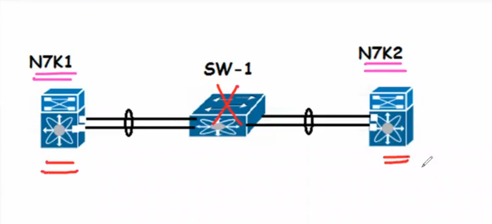
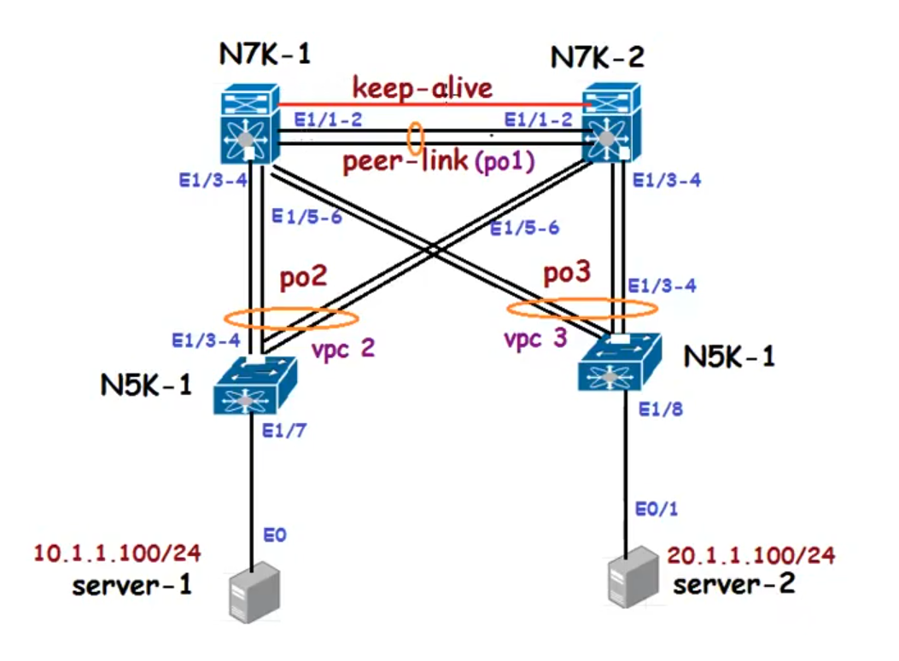
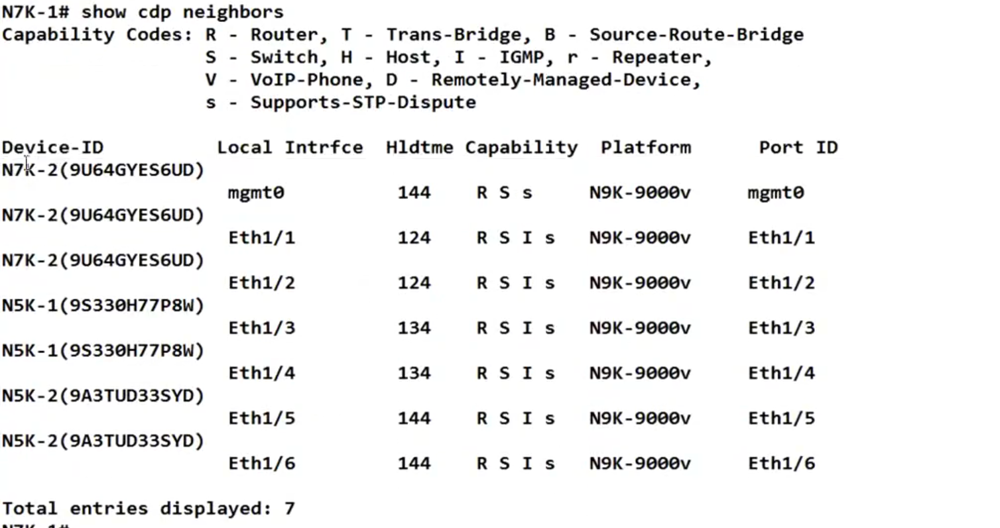
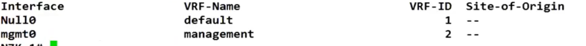
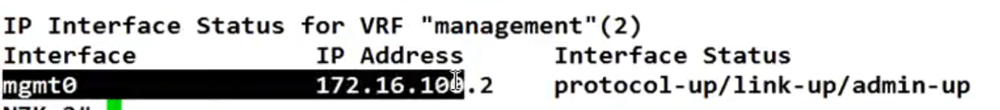
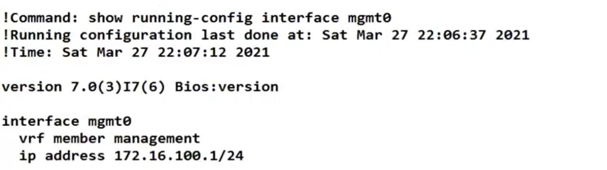
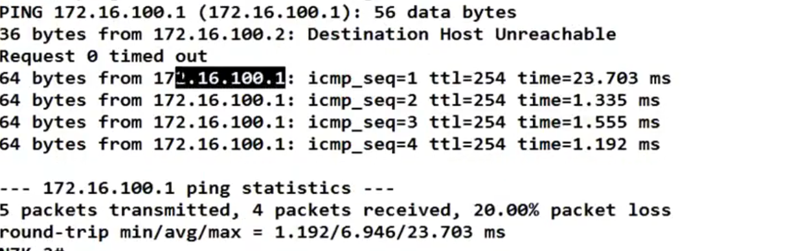

## vPC (Virtual Port Channel ) Introduction 
* Belongs to Multi chassi ether channel like VSS
* no more spanning tree blocked ports 
* provides fast convergence upon link or device failure 
* Simplifies the Network Design 

## Benefits of vPC
* Each peer device in the vPC domain runs its own control plane.

* If there is any issue in the control plane of one Peer, it will not impact another peer 

## Background 
* vPC technology is supported since NX-OS 4.1.3 (i.e since the introduction of NEXUS 7000 platform in 2009 (VPC+FEX 2010)
* vPC feature is included in the base NX-OS software license 
* vPC is a layer 2 technology we can't have L3 port channel in vPC 

* Peers must be identical (Same modal/modules/line cards etc)
    * Exceptions:
        * N7000 and N7700 in same VPC domain : OK
        * N5500 and N5600 in same VPC domain : NOK
        * VPC peers can have mix SUP (supervisor Module)
            * N9K SUP-A and SUP-B
            * N7K SUP1, SUP2 or SUP2E

## vPC terminologies 
* vPC: it's a port-channel between the VPC peers and the downstream devices 
* vPC Peer Device: one of the VPC peer member 
* vPC member port: port channel member of a vPC 

    #### Cisco Fabric Services (CFS)
* Protcol that is running in the background between the peer devices, it performs the following functions : 
    * Configuration validation and comparison (Consistency Check)
    * Synchronization of MAC addresses for vPC member Ports 
    * vPC member port status advertisement
    * Synchronization of HSRP/ARP and IGMP snooping 

* vPC peer-link: used to synchronize the state between vPC peer devices (arp/mac-table/igmp info etc)
    * It must be a 10 Gigabit link 
    * vPC peer link is a L2 trunk carrying vPC VLAN 

* vPC Domain ID: used to create the LACP ID to fool the downstream devices 
* vPC Keep-alive: used as a heartbeat(UDP port 3200 96 bytes long, with a 32-byte payload).As long as peers are reachable it works fine(no need of same subnet logic b/w peers)

* vPC VLAN: vlan allowed on the peer-link
* Orphan ports: which are single connected to any of the Peer.
* vPC keep-alive: used as a heartbeat (UDP 3200). As long as peers are reachable it works fine(no need of same subnet logic b/w peers)

#### Not Supported:-

### vPC configuration Steps 
1. Enable vPC feature 
2. Configure the domain-id
3. Establish the peer keep-alive link
4. Establish the vPC peer-link 
5. Configure the vPC member ports 

`
### Nexus 7000-1
N7K-1# config t
N7K-1(config)# feature vpc

N7K-1(config)# vpc domain ?
<1 - 1000> Domain id 

N7K-1(config)# vpc domain 1

N7K-1(config-vpc-domain)# 
N7K-1(config)#
N7K-1#show cdp neighbor 
`

N7K-1# sh vrf interface 

N7K-1(config)# int mgmt 0
N7K-1(config-if)# ip address 172.16.100.1/24

N7K-1# show ip int brief vrf management 

** mgmt 0 ip is 172.16.100.1 

N7K-1#conf t
N7K-1(config) # peer-keepalive destination 172.16.100.2
** when we hit enter, it means it will take mgmt vrf by default
N7K-1(config-vpc-domain)#

N7K-1# sh run int mgmt0

### Nexus 7000-2
N7K2-2# config t
N7K-2(config)# feature vpc

N7K-2(config)# vpc domain 1
N7K-2(config-vpc-domain)# exit
N7K-2(config)# int mgmt 0
N7K-2(config-if)# ip address 172.16.100.2/24

N7K-2(config)#exit
N7K-2# show vrf interface 

N7K-2# sh ip int brief vrf management 

N7K-2# ping 172.16.100.1 vrf management 

